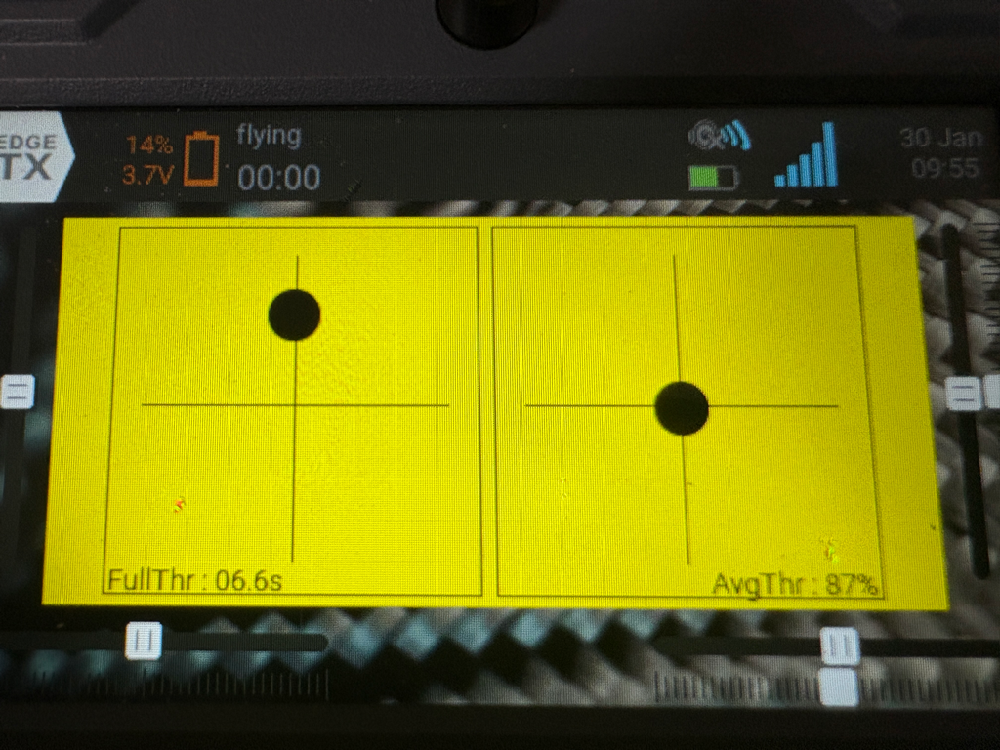

# StickViewWidget v0.1

EdgeTX 컬러 스크린 조종기용 스틱/스로틀 모니터 위젯입니다.

## 기능
- 좌/우 박스에 스틱 위치(점) 표시
- 풀 스로틀 누적 시간 표시
- 평균 스로틀 퍼센트 표시(0% 제외 샘플)
- 옵션 화면 열 때 통계 리셋

## 옵션
- DotSize: 도트 크기
- BgColor: 배경 색
- DotColor: 도트/선 색

## 위젯 추가 방법
1. SD카드에 위젯 폴더를 복사합니다: `/WIDGETS/StickView/`에 `main.lua`
2. 라디오에서 화면(레이아웃) 편집으로 들어갑니다.
3. 위젯 추가 → StickViewWidget 선택 → 옵션 설정

## 스크린샷

